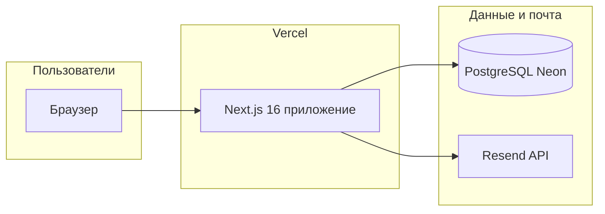

# Обзор проекта iPhone Dropship (iPhree)

Документ фиксирует **как устроен продукт**, **какие внешние сервисы задействованы**, **где что крутится** и **минимальные требования**. Цель — не заново собирать картину из чатов («у нас Vercel + Neon и есть админка»).

---

## Что это за продукт

Интернет-магазин (лендинг + каталог) продажи iPhone с программой кэшбэка и рефералов, личным кабинетом пользователя и **отдельной админ-панелью** для товаров, заказов, пользователей, настроек и модерации отзывов.

Публичное имя в интерфейсе по умолчанию: **iPhree** (переопределяется через `NEXT_PUBLIC_SITE_NAME`).

---

## Высокоуровневая схема

- **Пользователь** открывает сайт → запросы обрабатывает **Next.js** на **Vercel** (страницы, API routes, NextAuth).
- **Данные** (пользователи, заказы, товары, кэшбэк и т.д.) хранятся в **PostgreSQL** (**Neon**).
- **Письма** (подтверждение email при регистрации, сброс пароля, уведомления по заказам) отправляются через **Resend**.

---

## Где что развернуто

| Компонент | Сервис / место | Назначение |
|-----------|----------------|------------|
| **Приложение (фронт + API + auth)** | **Vercel** | Хостинг Next.js, деплой из GitHub (`main` → production). Пример URL: `https://iphone-dropship.vercel.app` + кастомный домен при подключении. |
| **База данных** | **Neon** (PostgreSQL) | Единственное хранилище состояния. Подключение через `DATABASE_URL` (pooler, SSL). |
| **Транзакционная почта** | **Resend** | Код подтверждения email, ссылка сброса пароля, письма по заказам. Ключ: `RESEND_API_KEY`, отправитель: `EMAIL_FROM` (домен должен быть верифицирован в Resend на проде). |
| **Исходный код** | **GitHub** | Репозиторий проекта; Vercel собирает из него. |

Связка **Vercel + Neon + Resend** — текущий целевой продакшен-стек.

---

## Технологии внутри репозитория

| Слой | Стек |
|------|------|
| UI | Next.js 16 (App Router), React 19, TypeScript, Tailwind CSS 4 |
| API | Route Handlers в `src/app/api/**` |
| ORM / БД | Prisma 5 → PostgreSQL |
| Авторизация | NextAuth.js 4, стратегия JWT, провайдер Credentials (email + пароль) |
| Локализация | EN / RU / UK (`src/lib/i18n`) |

Сборка на Vercel: в `package.json` скрипт `build` включает **`prisma db push`** перед `next build` — схема БД подтягивается при деплое (имейте в виду последствия для продакшена; при необходимости позже перейти на `migrate deploy`).

---

## Основные разделы сайта

| URL / зона | Кто | Назначение |
|------------|-----|------------|
| `/`, `/catalog`, `/product/[slug]` | Все | Витрина, каталог, карточка товара |
| `/register`, `/login`, `/verify-email`, `/forgot-password`, `/reset-password` | Гости / пользователи | Регистрация по **email** с кодом на почту, вход, подтверждение email, сброс пароля |
| `/checkout` | Авторизованный пользователь | Оформление заказа (Nova Poshta / курьер и т.д.) |
| `/dashboard/*` | Пользователь | Кабинет: рефералы, заказы, кэшбэк, настройки |
| `/ref/[code]` | Гость | Редирект с учётом реферального кода |
| `/admin/*` | **Роль ADMIN** | **Админка**: дашборд, товары, заказы, пользователи, заявки «перезвоните», отзывы, настройки, выдача бесплатного iPhone по правилам рефералов |

Доступ в админку — у пользователя с `role = ADMIN` в БД (сид создаёт `admin@example.com`, пароль из `ADMIN_PASSWORD` в `.env` при `npm run db:seed`).

---

## Авторизация и почта (актуальная логика)

1. **Регистрация** — email, имя, пароль → при **новом** email создаётся пользователь и уходит код на почту (если задан `RESEND_API_KEY`). Ответ API **унифицирован** (`{ ok: true }`), чтобы не раскрывать, занят ли email; в dev без ключа возможен пропуск верификации (`readyToLogin`).
2. **Подтверждение** — `/verify-email`, API `verify-email` / `resend-verification`. При подборе кода: после каждых **двух** неверных попыток включается блокировка на **5, 10, 20, 40…** минут (поля `wrong_attempts`, `locked_until` у токена). Ответы об ошибке унифицированы (`{ ok: false }`).
3. **Вход** — только **email + пароль**; без подтверждённого email вход блокируется с подсказкой перейти на подтверждение.
4. **Сброс пароля** — письмо со ссылкой на `/reset-password`; после успешной смены пароля `emailVerified` выставляется в `true`.
5. **Оферта / политика** — HTML из админки отдаётся через `/api/public/site` и на страницах прогоняется через **DOMPurify** (сервер + клиент), чтобы снизить риск XSS.

Регистрация по телефону / SMS в текущей версии **отключена** (исторически могли остаться строки в БД без email — таким аккаунтам вход по email недоступен).

---

## Требования к окружению

### Для разработки

- **Node.js** (LTS, совместимый с Next 16)
- **PostgreSQL** или доступ к **Neon**
- Файл **`.env`** (шаблон не в репозитории из‑за `.gitignore`; ориентир — переменные из `DEPLOYMENT.md` и обсуждения в команде)

### Для продакшена (минимум)

| Переменная | Зачем |
|------------|--------|
| `DATABASE_URL` | Neon PostgreSQL |
| `NEXTAUTH_SECRET` | Подпись сессий |
| `NEXTAUTH_URL` | Публичный URL сайта (например `https://…vercel.app` или свой домен) |
| `RESEND_API_KEY` | Регистрация с подтверждением почты и письма по заказам |
| `EMAIL_FROM` | Отправитель в Resend (на проде — свой домен) |
| `NEXT_PUBLIC_SITE_URL` | Ссылки в письмах и редиректах |
| `ADMIN_PASSWORD` | Только для `db:seed` (создание админа) |

Подробный чеклист и куда вносить переменные на Vercel — **[DEPLOYMENT.md](../DEPLOYMENT.md)**.

---

## Вспомогательные скрипты в репозитории

| Скрипт | Назначение |
|--------|------------|
| `scripts/smoke-auth-flow.ts` | Локальная/прод-проверка цепочки: verify-email → login → reset-password → login (нужен запущенный сервер; для прода задать `SMOKE_BASE_URL`). |
| `scripts/cleanup-reg-smoke.ts` | Удаление тестовых пользователей `reg-smoke-*` из БД. |

---

## Связанные документы

- **[README.md](../README.md)** — быстрый старт, структура папок, фичи.
- **[DEPLOYMENT.md](../DEPLOYMENT.md)** — переменные окружения, чеклист перед продом, `db push` / seed.

---

## Хранить ли этот файл в GitHub?

**Да.** Такой обзор — нормальная практика: он в репозитории рядом с кодом, виден всей команде и не содержит секретов (пароли и ключи в документ не вносятся). При смене хостинга или провайдера БД достаточно обновить этот файл и `DEPLOYMENT.md`.
